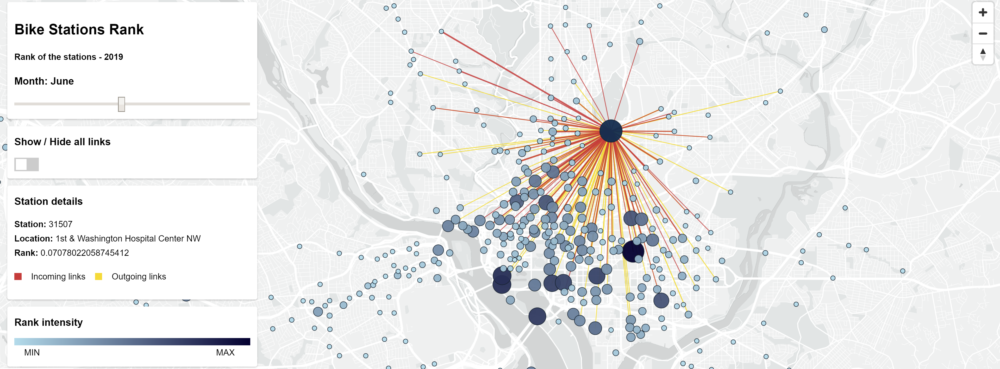
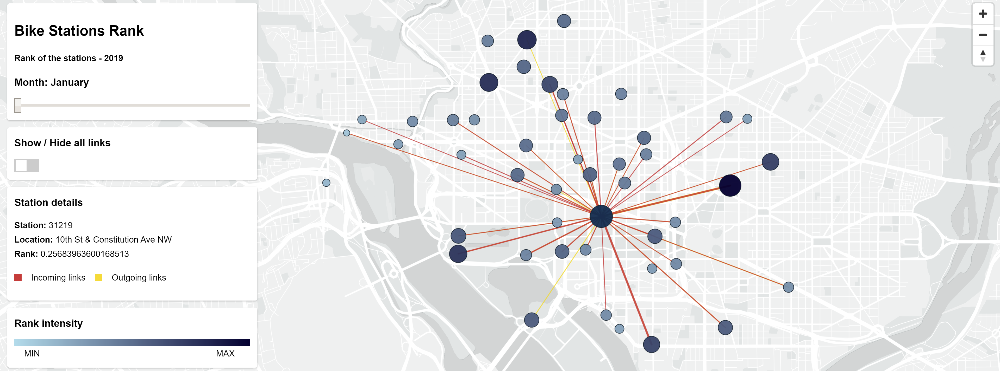

# SCALABLE AND CLOUD PROGRAMMING PROJECT 
***A.A. 2019/2020 - Antonio Lategano, Salvatore Visaggi***

**Table of contents:**

* [Project Description](#project-description)
    * [Dataset](#dataset)
    * [Project Structure](#project-structure)
* [Before you begin](#before-you-begin)
* [Setting up the project](#setting-up-the-project)
    * [Creating the jar executable](#creating-the-jar-executable)
    * [Explaining config.json structure](#explaining-config.json-structure)
    * [Installing the Map Viewer app](#installing-the-map-viewer-app)
* [Running the project](#running-the-project)
* [Extra](#extra)
    * [Demo description](#demo-description)
    * [Using the gcloud command-line tool](#using-the-gcloud-command-line-tool)

## Project Description



The main purpose of this project is to compute the Weighted PageRank for the bike stations of the
[CapitalBikeShare][capital_bike] network in Washington DC developing a scala-spark app.  
The PageRank of the stations is computed considering the [tripdata of the year 2019][capital_bike_data].  
The PageRank algorithm for weighted edges is a modified version of the [NetworkX implementation][networkx_pagerank].  
The Computation is done on the Google Cloud Platform using the [Dataproc][product-docs] and Storage solutions.  
A client-server webapp is also developed to run and control the computation on the GCP using the 
[Nodejs APIs][cloud-nodejs-docs] and to show the result on an interactive map using the [MapBox GL APIs][mapbox-api].

### Dataset
The [dataset][capital-bike-data-source] is divided in 12 files, one for each month of the year 2019.  
Each row in a file contains a single trip information, composed by a `Start station number`, an `End station number`,
a `Start date`, an `End date` and other properties that we have not taken in account.  
The files are stored in folder `./data/input/`.  

A trip from a `source` to a `destination` could exist more than one time. During the building of the Graph, 
firstly, for each couple `source-destionation`, the number of times the same couple appears is set as the
 weight of that edge. 
After, following the formula for the [weighted Pagerank][networkx_pagerank], for each station, the weights of the 
outgoing edges is normalized such that the sum of outgoing edges is 1.

For each file there are up to 350-400 thousands trips. The number of stations in the graph is 581.

### Project Structure
The project consists of a Node.js webapp and a Scala-Spark app.  
The Scala-Spark app is the core of the computation: it is developed for computing the PageRank of the stations in 
the weighted graph.  
The Node.js webapp is a client-server app. The client side runs the requests for the computation and shows the results 
on an interactive map. The server side uses the Google Cloud Node.js APIs ([Dataproc][client-dataproc-docs], [Storage][client-storage-docs]) for uploading the files, 
 running the Scala-Spark app as a Job in a Dataproc cluster and for downloading the results. 

Below it is shown the project files and folders structure. It is useful to know for the further steps.

```
projectScalable
|
├── data
|   └── input/[input-files]
|
├── mapViewer
|   ├── bin
|   |   └── www
|   ├── public
|   |   ├── data
|   |   |   ├── demo/[demo-files]
|   |   |   ├── capitalbikeshare-stations.csv
|   |   |   └── result-demo.json
|   |   ├── js
|   |   |   ├── data.js
|   |   |   ├── gcp-dataproc.js
|   |   |   ├── geoJson.js
|   |   |   ├── map.js
|   |   |   ├── properties.js
|   |   |   └── run.js
|   |   ├── stylesheets
|   |   |   └── style.css
|   |   └── index.html
|   └── routes
|       ├── app.js
|       ├── config.json
|       ├── package.json
|       └── package-lock.json
|
├── project
|   └── plugins.sbt 
|
├── src/main/scala
|   └── pagerank
|       ├── package.scala
|       ├── GraphBuilder.scala
|       ├── Main.scala
|       ├── PageRank.scala
|       ├── PageRankGraph.scala
|       ├── SparkApp.scala
|       └── Utils.cala
|
└── build.sbt
```

## Before you begin

1.  [Select or create a Cloud Platform project][projects].
1.  [Enable billing for your project][billing].
1.  [Enable the Google Cloud Dataproc API][enable_api_dataproc].
1.  [Enable the Google Cloud Storage API][enable_api_storage].
1.  [Set up authentication with a service account][auth] so you can access the
    API from your local workstation. Save the JSON key and store it carefully on your local workstation for 
    further use, as explained in [Setting up the project](#setting-up-the-project).

## Setting up the project

### Creating the jar executable
To create the fat JAR file (i.e. a jar with all the dependencies the program requires) 
we used `sbt-assembly`. To get the fat JAR, run the command below in the root folder of the project
and it will automatically create the `projectScalable.jar` file in the `data` folder of the project.
```
cd projectScalable
sbt assembly
``` 

### Explaining config.json structure
The file `config.json` is located in the folder `projectScalable/mapViewer`. This file contains the configuration
values for running the app. The structure of the configuration is shown below.
```
{
    keyFileName: string
    gcp: {
        projectId: string,
        location: string,
        bucket: {
            bucketName: string,
            storageClass: string
        },
        cluster: {
            clusterName: string,
            config: {...}
        },
        job: {
            jarFileDir: string,
            jarFileName: string,
            jarArgs: {
                inputDir: string,
                outputDir: string,
                numIterations": string,
                dampingFactor": string,
                local: string
            }
        }
    },
    input: {
        inputPath: string,
        inputLinksFiles: [string] 
    },
    output: {...}
}
```

#### KeyFileName
The `keyFileName` is the path where the [key for accessing the Google Cloud APIs](#before-you-begin) is stored 
on your local workstation. **Set this value before to continue**.  

#### GCP
The `gcp` values are used for setting bucket, cluster and job properties on GCP.  
Set the value `projectId` as that your key is associated. Then, set the values
 `location`, `bucketName` and `clusterName` as you like, or leave them as they are.   
 You could change the configuration of the cluster. As default, the cluster is composed of a master and
  3 workers with 2 standard CPUs each one.  
The `Job` field contains the properties of the JAR to be uploaded and submitted to Dataproc. 
`jarFileDir` and `jarFileName` specifies the location of the JAR on your local workstation. 
By default, the JAR is placed inside the folder `data`.  

The `jarArgs` specifies the arguments to be passed to the JAR when launching it.
The arguments to be passed as input to the JAR are:
- `--inputDir` - the folder where all the files to process are located on the Bucket.
- `--outputDir` - the folder where all the output files will be saved on the Bucket.
- `--numIterations` - by default is set to `10`, it is the number of iteration for PageRank algorithm.
- `--dampingFactor` - by default is set to `0.85`, it is the damping factor for PageRank algorithm.
- `--local` - by default is set to `false`. When running the JAR on a local machine, it should be set to `true`.
The `--inputDir` and `--outputDir` parameters are set dynamically according to the Bucket properties, so it is not
required to change these fields.
Also, you can decide to use the default values for the other arguments, or you can change the values according to 
the default settings.

#### Input
The field `input` specifies the path and the names of the files to be processed. 
By default, the `data/input` folder contains all the input files named by `[year][month]-capitalbikeshare-tripdata.csv`.

#### Output

The field `output`specifies the folders and the properties for downloading and referencing the output of the
 computation once it is done on the Cluster. It is not required to modify this field.

### Installing the Map Viewer app
The MapViewer app source is located in the `mapViewer` folder. For installing and running the app, it is required 
[Node.js][nodejs-download] to be installed on your local workstation.  
For installing the required packages: 
```
cd projectScalable/mapViewer
npm install
```
After installation, for running the app:
```
npm start
```

## Running the project
Before running the project, be sure that you have followed the previous steps:
- The fat JAR has been generated and placed in the folder `data` or it is
linked in the `config.json` file.
- The key for accessing GCP apis is generated and linked in the `config.json` file.
- The `projectId` in the `config.json` is set as the key associated.

For running the project, run the command `npm start` in the `mapViewer` folder.

Once the app is running, you will see a message in the command line: `listening on port 3000`.  
Open a browser with javascript enabled and connect to the server `localhost:3000`.  
Once connected, you will see two buttons: `Launch Demo` and `Launch GCP`.  

`Launch Demo` loads the local files and shows few stations on the map as described in the 
[Demo section](#demo-description).

`Launch GCP` runs the operations for running the Scala-Spark on a Google Cloud Dataproc Cluster.
The steps done are listed below:
- Initialization of Clients for connecting to Google CLoud APIs.
- Creation of the Bucket.
- Creation of the Cluster with the specified configuration (this may take up to 90s).
- Upload of input files and JAR file to the Bucket.
- Submit of the Job to the cluster.
- Download of the results computed by the Job.
- Launch of the client app for viewing the map.
 
 Each step is excecuted automatically and you will be able to see the progress on the webpage.  
 Once all the steps are done successfully, an interactive map is shown with the stations and links.  
 If something goes wrong, an error explanation is shown and the app tries to delete all the allocated resources on
 the Google Cloud Platform.

## Extra

### Demo description


The demo is made for showing an example of the result of computing the PageRank.
In the demo it is shown only about 50 stations. The demo is built from a reduced portion of the original dataset,
considering only the tripdata of the reduced number of stations.

The result files of the demo are located inside the folder `mapViewer/public/data/demo`.

To launch the demo, once the [Setup is done](#setting-up-the-project), simply connect to `localhost:3000` on your browser and click on the
`launch demo` button.

### Using the gcloud command-line tool
Another way to compute the PageRank using the scala-spark app is through the [gcloud command line tool][gcloud-sdk].

#### Create a new Google Cloud project
After installing and initializating the gcloud sdk, you have to create a Google Cloud project and [enable 
billing and Dataproc API][gcloud-dataproc-billing].

```
gcloud projects create scalable-pagerank
```

#### Create a new bucket
This command allows you to create a new bucket used to store all the data required to 
the project. It is also used to store the results of the computation (nodes ranks and links). 
```
gsutil mb -p scalable-pagerank -l europe-west3 -c STANDARD gs://scalable-pagerank-bucket/
```
#### Create a cluster 
This below is an example with four nodes: a master and three workers. You are free to 
apply changes. Bear in mind that the actual image-version (1.5-debian10) has the
correct version of Scala and Spark. The cluster will be automatically deleted after 15 minutes 
to prevent waste of money (`max-age`). 
```
gcloud dataproc clusters create scalable-pagerank-cluster
--region europe-west3
--subnet default
--zone europe-west3-a
--master-machine-type n1-standard-2
--master-boot-disk-size 30
--num-workers 3
--worker-machine-type n1-standard-2
--worker-boot-disk-size 30
--image-version 1.5-debian10
--max-age=t15m
--project scalable-pagerank
```


#### Copy jar and input files to Cloud Storage
To start the computation you need to upload the executable and the input files to the Bucket.
Input files must be stored all inside the same folder (e.g. `gs://scalable-pagerank-bucket/input/`). 
This because the [JAR app](#creating-the-jar-executable) takes as input argument 
the folder where all the files to be processed are stored, and executes the computation on all the files.
```
gsutil cp [your_local_path]/projectScalable.jar gs://scalable-pagerank-bucket/
gsutil cp [your_local_path]/[year][month]-capitalbikeshare-tripdata.csv gs://scalable-pagerank-bucket/input/
```

#### Submit jar to a Cloud Dataproc Spark job
For the JAR args see [JarArgs](#GCP).
This command submits a spark job on the Cluster specified.
```
gcloud dataproc jobs submit spark 
--cluster scalable-pagerank-cluster
--jar gs://scalable-pagerank-bucket/projectScalable.jar --
--inputDir=gs://scalable-pagerank-bucket/input/
--outputDir=gs://scalable-pagerank-bucket/output/
```

#### Delete the cluster and the bucket
The cluster is automatically deleted after 15 minutes to prevent waste of money. If you want to delete it before (and 
delete also the bucket) use the following comamnds. 
```
gcloud dataproc clusters delete scalable-pagerank-cluster
gsutil rm -r gs://scalable-pagerank-bucket/
```


[client-dataproc-docs]: https://googleapis.dev/nodejs/dataproc/latest
[client-storage-docs]: https://googleapis.dev/nodejs/storage/latest
[cloud-nodejs-docs]: https://github.com/googleapis/google-cloud-node
[product-docs]: https://cloud.google.com/dataproc
[projects]: https://console.cloud.google.com/project
[billing]: https://support.google.com/cloud/answer/6293499#enable-billing
[enable_api_dataproc]: https://console.cloud.google.com/flows/enableapi?apiid=dataproc.googleapis.com
[auth]: https://cloud.google.com/docs/authentication/getting-started
[enable_api_storage]: https://console.cloud.google.com/flows/enableapi?apiid=storage-api.googleapis.com
[capital_bike]: https://www.capitalbikeshare.com/
[capital_bike_data]: https://www.capitalbikeshare.com/system-data
[networkx_pagerank]: https://networkx.github.io/documentation/networkx-1.10/reference/generated/networkx.algorithms.link_analysis.pagerank_alg.pagerank.html
[mapbox-api]: https://docs.mapbox.com/mapbox-gl-js/api/
[capital-bike-data-source]: https://s3.amazonaws.com/capitalbikeshare-data/index.html
[nodejs-download]: https://nodejs.org/en/download/
[gcloud-sdk]: https://cloud.google.com/sdk/docs/quickstarts
[gcloud-dataproc-billing]: https://cloud.google.com/dataproc/docs/guides/setup-project?authuser=2`